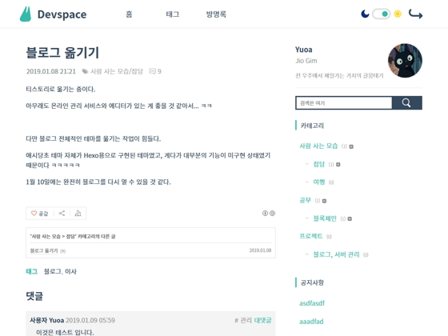

# Prontera



## 기능과 특징
#### 지원하는 기능
+ 홈 화면
+ 태그 클라우드
+ 방명록
+ 페이지
+ Github, 개인 홈페이지 바로가기
+ 사이드바
    - 개인 소개 + RSS 구독 버튼
    - 검색
    - 카테고리
    - 공지사항
    - 최근 글
+ 화면 모드 전환 (밝게, 어둡게)
+ 페이지 이동 효과 (로고 부분)
+ 가장 위로 바로가기

#### 지원하지 않는 기능
+ 위치 로그, 미디어 로그
+ 댓글에 홈페이지 정보 입력하기
+ Internet Explorer에서의 접속

#### 곧 추가할 기능
+ 모바일 대응 (반응형)
+ 웹 접근성 확장 대응
+ 검색 결과, 태그 결과 표시
+ 간헐적으로 나타나는 화면 모드 비정상 오류 수정
+ `index.xml`과 `package.json` 설명, 버전 연동 (`index.xml` 기준으로)  

## 스킨 파일 빌드하기
#### 요구 사항
+ [node](https://nodejs.org/ko/) `버전 10 이상의 환경에서 테스트 되었음`
+ [yarn](https://yarnpkg.com/lang/en/)

#### 빌드 방법

```sh
$ git clone https://github.com/yuoa/prontera; cd prontera
$ yarn --prod=false
$ yarn gulp build
```

#### 설치 방법

1. 블로그 관리 페이지의 `꾸미기 > 스킨 변경`에서 `스킨 등록 +` 버튼 클릭
2. `./out` 디렉토리 안의 모든 파일을 추가
3. 원하는 이름으로 저장 후 적용 

## 라이센스
디자인의 토대는 [AngryPowman](https://github.com/AngryPowman)의 [Prontera](https://github.com/AngryPowman/hexo-theme-prontera)에서 가져왔습니다.  
이 프로젝트는 Mozilla Public License 2.0를 따릅니다.  
프로젝트에 사용된 `svg` 아이콘의 저작권은 비상업적 이용이 허가된 아이콘으로, 자세한 내용은 [이 링크](https://www.svgrepo.com/info/licensing)에서 설명합니다.  
